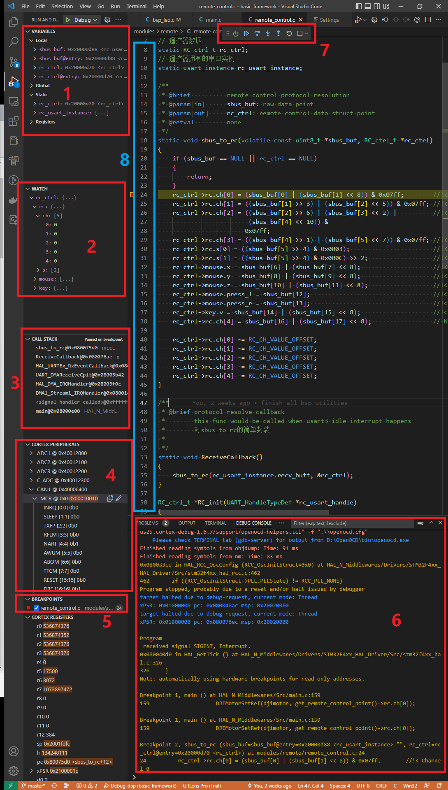
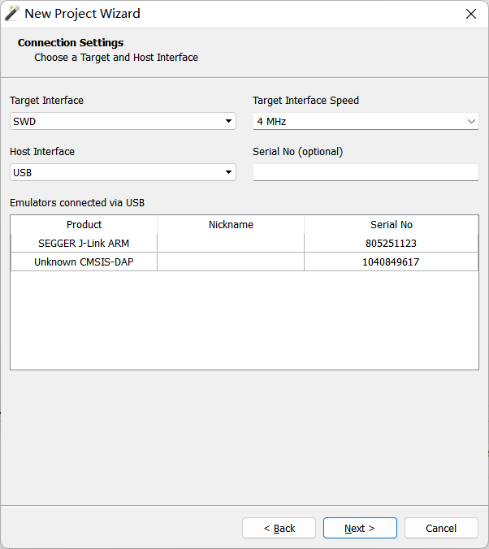
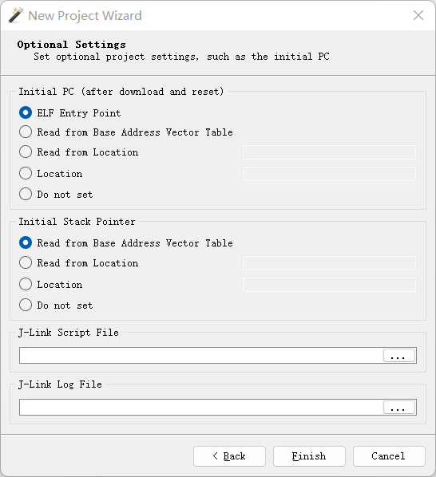

# Alliance2024电控空白代码框架

[TOC]

## 环境配置

参考视频：    [4分钟！嵌入式拿到一个新电脑到开始调试要多久？2个软件+2个插件](https://www.bilibili.com/video/BV1w84y1S7wv)

  [VScode+Ozone环境配置演示](https://www.bilibili.com/video/BV1ku411T7Ye)

  [基于Embedded IDE的环境配置](https://fa4g5no1b1f.feishu.cn/docx/DJTUd3kiroIOJNxjBmxcz1cnntf) 

## VScode插件推荐

> ==高亮插件==为推荐安装，其他插件酌情安装

### 中文

- **==Chinese== (Simplified) (简体中文) Language Pack for Visual Studio Code**：中文

### Git源代码管理/团队合作

- **==Git Graph==**:可视化commit
- **==GitHub Pull Requests and Issues==**：管理Pull Request和问题，主分支只能通过Pull Request提交
- **GitLens**： Git管理工具，开源代码不要钱，闭源代码收费
- **live share**：和你的小伙伴一起结对编程，类似多人文档编辑

### 代码方便性

- **indent-rainbow**：彩虹缩进
- **Hex Hover Converter**：鼠标悬停在数值上的时候会自动显示其对应的16、2、10进制值和编码
- **Hex Editor**：在查看汇编代码和机器代码的时候，提供2、10、16进制转换，并且可以以16进制或2进制的格式编辑文件。
- **CodeGeeX: AI Code AutoComplete, Chat, Auto Comment**：中国免费AI辅助
- **==Better Comments==**：在代码中创建更人性化的注释
- **Better C++ Syntax**：提供更丰富的代码高亮和智能提示，会改变一些颜色
- **C/C++ Snippets**：提供代码块（关键字）补全
- **Blockman - Highlight Nested Code Blocks** ：此插件会高亮嵌套的代码块（即花括号包围的部分或for/while/if else代码块），对于多层条件和循环嵌套效果非常炸裂
- **Bookmarks**：提供代码中插入书签的功能，从而快速在页面间跳转。

### BUG纠错

- **Error Gutters**: This is the VSCodium (or Visual Studio Code) version of error gutters available in other text editors, such as Sublime Text or Atom.
- **Error Lens**: ErrorLens turbo-charges language diagnostic features by making diagnostics stand out more prominently, highlighting the entire line wherever a diagnostic is generated by the language and also prints the message inline.
- **SonarLint**：更严格的语法检查

### 字体推荐

==Fira Code==


## VSCode调试

### 常用快捷键

| 功能                   | 快捷键        |
| ---------------------- | ------------- |
| 选中当前行             | Ctrl+L        |
| 删除当前行             | Ctrl+Shift+K  |
| 重命名变量             | F2            |
| 跳转到定义             | Ctrl+点击     |
| 在打开的文件页中切换   | Ctrl+Tab      |
| 在当前文件查找         | Ctrl+F        |
| 在整个项目文件夹中查找 | Ctrl+Shift+F  |
| 查找所有引用           | Alt+Shift+F12 |
| 返回上一动作           | Alt+左        |

更多快捷键可以按ctrl+K再按ctrl+S显示，并且可以修改成你最习惯的方式。此外，使用Snippets可以大幅度提高重复性的代码编写速度，它可以直接帮你补全一个代码块（如for、while、switch）；补全和snippet都使用`Tab`键接受代码提示的提议，通过↑和↓键切换提示。

### 调试界面



#### 1. 变量查看窗口

包括当前调用栈（当前作用域或代码块）内的局部变量、当前文件的静态变量和全局变量。register选项卡可以查看cpu内核的寄存器数值。

#### 2. 变量watch窗口

右键单击要查看的变量，选择watch加入查看。

   

   还支持直接运行到指针所选处（Run to Cursor）以及直接跳转到指针处执行（Jump to Cursor）。添加行内断点（若一个表达式由多个表达式组成）也是很方便的功能，可以帮助进一步定位bug。

   右键点击添加到watch窗口的变量，**可以临时修改它们的值。**调参的时候非常好用。

   VSCode提供的一个最大的便利就是，你可以将鼠标悬停在需要查看的变量上，**不需要添加到watch就能观察变量值。**如果是指针还可以自动解析，获取解引用后的值。结构体也支持直接展开。

   

   > **现在Cortex-Debug插件也已经支持live watch（变量动态监视）**，最高可设置的刷新频率为4Hz，足堪大用，我们可以宣告KEIL的时代已经落幕！但是更复杂，更高频率的变量观测以及可视化功能还是需要通过ozone完成。
   >
   > 具体通过在launch.json中添加livewatch实现
   >
   > ```json
   > "liveWatch": {
   >              "enabled": true,
   >              "samplesPerSecond": 4
   >          },
   > ```

#### 3. 调用栈

表明在进入当前代码块之前调用了哪些函数，称之为栈也是因为调用的顺序从下至上。当前函数结束之后栈指针会减小，控制权会返还给上一级的调用者。通过调用栈可以确认程序是**如何**（按怎样的顺序）运行到当前位置的。

#### 4. 片上外设

这里可以查看外设的**控制寄存器**和**状态寄存器**的值，如果通过断点无法定位bug，则需要查找数据手册和Cortex M4指南的相关内容，根据寄存器值来判断程序当前的情况。

#### 5. 断点

所有添加的断点都会显示于此，注意，不像我们自己的电脑，单片机的DBG外设对断点的数量有限制（资源所限），超过5个断点会导致debug失败，此时将断点减少即可。由于单行代码编译之后可能会对应多条汇编指令，或一条表达式由多个表达式构成，你还可以插入**行内断点**以逐个执行表达式或汇编语句，你还可以在汇编窗口插入断点调试汇编代码，帮助你发现错误。

   对于不方便判断何时需要停止代码执行进行观察和测试的情况，你可以右键行号左侧的断点栏插入条件断点，输入表达式，当表达式满足时才会进入断点。

#### 6. 调试控制台

调试器输出的信息会显示在这里，要**查看**和**追踪**的变量的信息也会显示在这里。如果调试出现问题，报错信息同样也会在这里显示。要是出现异常，可以复制这里的信息在搜索引擎里查找答案，不过最好的方法是查询gdb和openocd的官方文档。

#### 7. 调试控制

   - 复位：单片机复位
   - 继续运行/暂停
   - 单步跳过，如果这一行有函数调用，不会进入内部
   - 进入，如果这一行有函数调用，会进入函数内部
   - 跳出，跳出当前调用栈顶层的函数，即如果在函数内部会直接运行到return
   - 重启调试器（当然单片机也会复位，一般出现异常的时候使用这个按钮）
   - 终止调试

## Ozone可视化调试和LOG功能

### 配置调试项目

打开ozone后会显示一个new project wizard，如果没有打开，在工具栏的File-> New -> New project wizard。


选择M4内核，为了能够查看外设寄存器的值还需要svd文件。所有mcu的svd都在图中的文件夹里提供，当然你也可以使用我们仓库根目录下的文件。



接口选择swd，接口速度不需要太高，如果调试的时候需要观察大量的变量并且使用日志功能，可以调高这个值。如果连接了jlink，上面的窗口中会显示。如果链接了dap-link，比如无线调试器，会出现Unknown CMSIS-dap。选择你要使用的调试器，然后继续。


选择构建之后生成的.elf文件（在项目文件夹下的build中）。这是调试器专用的文件格式，对其内容感兴趣可以自行搜索细节。此外ozone还支持.bin .hex .axf（最后一个是amr-cc，也就是keil的工具链会生成的）等格式。



这页不要动。如果希望保存jlink的调试日志，最后一个选项选择一个文件或者新建一个日志文件。

### 启用FreeRTOS支持

> 注意，如果你的代码使用了实时系统，在载入项目的时候Ozone会进行对应的提示。选择载入支持实时系统的插件即可。
>

如果没有提示，请在console中输入下面的命令然后回车即可：

```shell
Project.SetOSPlugin(“plugin_name”)
# plugin_name是启用的实时系统支持插件名
# 我们要使用的命令是Project.SetOSPlugin ("FreeRTOSPlugin_CM4")
```

支持的插件在Ozone的安装目录下的`Plugins/OS`目录：


我们的项目是F4的板子，内核时Cortex-M4（CM4），因此选用`FreeRTOSPlugin_CM4.js`（输入的时候js后缀不用输）。 

### 常用调试窗口和功能

> 如果没有对应的窗口请在菜单栏的view中选择

下图的配置是笔者常用的layout。每个窗口是否显示、放在什么位置等都是可以自己定义的。通过工具栏的view选项卡可以自行选择需要展示的窗口。


#### 1. 调试控制

和vscode类似

#### 2. 变量watch窗口

这里的变量不会实时更新，只有在暂停或遇到断点的时候才会更新。若希望实时查看，在这里右键选择需要动态查看的变量，选择Graph，他就会出现在**窗口8**的位置。

   如果不需要可视化查看变量变化的趋势，但是想不暂停查看变量的值，请右键点击变量，选择一个合适的refresh rate：

   

   如果是一个结构体，你可以为整个结构体都进行刷新率的配置，不需要手动一个个修改。**或直接右键点击窗口**，将refresh打勾：

   

#### 3. 断点和运行追踪管理

#### 4. 调试控制台

输出调试器的信息。

#### 5. 终端

支持一些jlink script的命令。**单片机通过log模块发送的日志也会显示在这里。**

#### 6. 代码窗口

用于添加断点、添加查看等。鼠标悬停在变量上可以快速查看变量值和类型。希望打开整个项目文件，点击工具栏的view选项卡，单击Source Files就可以打开一个项目中所有源文件的窗口。右键点击函数或变量可以跳转到定义和声明、查看汇编代码等。按**F12**跳转到定义。

#### 7. 变量可视化窗口

**这就是Ozone的大杀器。**在变量添加到查看（watch）之后，右键点击watch中的变量选择Graph，变量会被添加到可视化查看中。你可以选择“示波器”的显示时间步长以及颜色等信息，还可以更改采样率。

   **注意，如果添加到动态调试窗口中没有反应，请在窗口8中修改一下”Sample Freq“为100Hz或200Hz即可**。

#### 8. 变量采样数据窗口

在窗口8中会实时显示变量值，并且统计平均值和最大最小值，**而且还会将所有采样值保存到一个csv文件当中**，如果需要进一步分析可以导出这个数据文件。若要进行系统辨识、前馈设计等，这无疑是最好的方法。这还可以方便我们观察采样值的异常，进一步提升debug的效率。

#### 9. 内存视图

可以直接查看任意内存位置的值。

如果在调试过程中发现bug或者需要更改代码，不需要终止调试或者关闭窗口。直接前往vscode修改并重新编译，Ozone会自动检测到.elf文件的变化，询问你是否重新加载项目。选择是后会自动开始下载并进入调试。

- **变量动态查看（可视化）**

  - **在变量的watch窗口右键点击变量，选择一个refresh rate也可以实时查看变量（和keil一样）。**

  - 如果没有打开窗口，现在view->timeline中打开可视化窗口。动态变量查看的窗口也在view->data sampling。

    启用动态变量查看的流程如下：

    ```mermaid
    graph LR
    在代码窗口中选中需要观察的变量 --> 添加到watch窗口 --> 在watch选择要动态查看的变量 --> 添加到Datasample窗口
    ```

    第一步的快捷键是`ctrl+w`，选中变量之后按。

    第二部的快捷键是`ctrl+g`，选中watch中的变量后按。

    第三步可以修改示波器的步长和采样频率。

  - 如果当前文件没有你要的变量，你想查看项目中的其他文件夹，在view-> source files中可以打开该项目所有的源文件，双击可以打开源文件。

    

- **日志打印**

在Terminal窗口查看，还可以通过命令直接控制单片机的运行（不过不常用）。

未打开窗口则在view-> terminal中打开。使用bsp_log打印的日志会输出到该窗口中.

- **外设查看**

在view-> register中打开窗口，选择Peripherals可以查看所有外设寄存器

CPU选项卡可以查看CPU的寄存器。

- **调用栈**

在view-> call stack中打开窗口。

### 常用快捷键

| 组合                 | 功能                                                 |
| -------------------- | ---------------------------------------------------- |
| ctrl+w               | 添加到查看                                           |
| ctrl+g               | 添加到动态查看（需要先添加到查看）                   |
| f12                  | 跳转到定义                                           |
| f5                   | 启动调试                                             |
| f10                  | 单步跳过                                             |
| f11                  | 单步进入                                             |
| shift+f11            | 单步跳出                                             |
| 右键+break on change | 当变量发生变化的时候进入此断点                       |
| ctrl+H               | 展示调用图，会列出该函数调用的所有函数（内部调用栈） |

如果你使用拥有多个按键的鼠标,推荐将侧键前设置为ctrl+点击以查看声明/定义,侧键后设置为添加到watch(debug),侧滚轮设置为前进后退(历史)

你还可以按ctrl+K ctrl+S进入快捷键设置页面,将tab设置为下一个提示,用enter接受intelliSense建议,这样不需要将手移出主键盘区域. 将ctrl+;设置为移动到行尾,同时打开c/c++的函数括号不全,这样不需要手动敲击括号.

将alt+k设置为左移,alt+l设置为右移,这样不需要方向键.

选择最适合自己的配置!

### 保存调试项目

退出时可以将调试项目保存在项目的根目录下，方便下次调试使用，不需要重新设置。可以为jlink分别保存一套调试配置。

### 同步vscode代码

在ozone中的代码修改能自动同步到vscode，但是vscode中修改了代码需要编译一次ozone才能刷新代码，第一次会弹出一个窗口


勾选`Do not show again`后就不会再弹出此窗口，在vscode中编译后即可直接同步。
